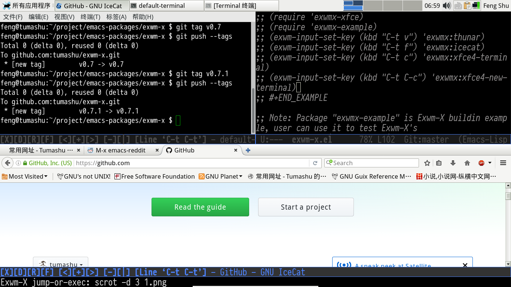

- [Exwm-X](#org7f8f58a)
  - [What is Exwm-X](#org1e346e6)
  - [Showcase](#org64ff7e5)
  - [Feature](#org5f75163)
    - [Appconfig](#org0c3f548)
    - [Window operate buttons.](#org37c751e)
    - [Move or resize a floating-window without press WIN key.](#org90e8089)
    - [Jump-or-exec](#orgf1019e0)
    - [Dmenu](#orgd8c31fb)
    - [Send a string to application](#orgcb40d31)
  - [Install](#org2319a8e)
  - [Configure](#org68b98eb)
    - [Add exwm-x directory to emacs's load-path](#orgdc0169d)
    - [Edit "~/.initrc" file or "~/.xsession" file](#org2925f5b)
    - [Make "~/.initrc" or "~/.xsession" excutable](#org04281c4)
    - [Edit "~/.exwm-x"](#org39d0181)

# Exwm-X

## What is Exwm-X

Exwm-X is a derivative window manager based on EXWM (emacs x window manager), which focus on Mouse-Control-People.

## Showcase

1.  Tilling windows

    

2.  Floating windows

    

## Feature

### Appconfig

\`exwmx-appconfig' is a database manager, which is used to record and manage appconfigs (plist of application's information), when run \`exwmx-appconfig', a buffer will be poped up, this buffer's content is current appconfig's template, user can edit the template and run \`exwmx-appconfig-finish' to save your change or run \`exwmx-appconfig-ignore' to ignore your change.

All appconfig will be saved into file \`exwmx-appconfig-file'.

By default, the following keys of appconfig will be recorded:

1.  :command

    Application's shell command string.

2.  :alias

    This key can define an application's alias, which is used by \`exwmx-jump-or-exec'.

3.  :pretty-name

    In EXWM, every application will bind an emacs buffer, if you set :pretty-name for a application, the buffer will rename to :pretty-name's value.

4.  :paste-key

    This key record the paste keybinding of application, which is used by \`exwmx-sendstring'.

5.  :class

    Record the application's class, which is used by \`exwmx-jump-or-exec'.

6.  :instance

    Record the application's instance, which is used by \`exwmx-jump-or-exec'.

7.  :title

    Record the application's title, which is used by \`exwmx-jump-or-exec'.

### Window operate buttons.

Exwm-X add the following **buttons** to mode-line, user can left or right click them to operate app's window:

1.  [X]: Delete the current application.
2.  [D]: Delete the current emacs window.
3.  [R]: Run exwm-reset.
4.  [F]: Toggle floating/tilling window.
5.  [<]: Move window border to left.
6.  [+]: Maximize the current window.
7.  [>]: Move window border to right.
8.  [-]: Split window horizontal.
9.  [|]: Split window vertical.
10. [\_]: minumize floating application
11. [Z+]: Zoom+ floating application's window
12. [Z-]: Zoom- floating application's window
13. [Line 'XXXX']: toggle EXWM char-mode/line-mode

### Move or resize a floating-window without press WIN key.

By default, EXWM use 's-<down-mouse-1>' to move a floating-window and 's-<down-mouse-3>' to resize a floating-window.

When Exwm-X is enabled, user can drag **the apps title** showed in mode-line to move a floating-window. and left or right click '[Z+]' and '[Z-]' in mode-line to resize a floating-window.

### Jump-or-exec

Only run application once. when an application's window is found, jump to this window instead of launch the application again, this feature need the appconfig information in \`exwmx-appconfig-file'.

1.  The simplest usage:

        (exwmx-jump-or-exec "firefox")

2.  Define an alias

    In the following example: \`exwmx-jump-or-exec' will search an appconfig which :alias is "web-browser", and then run this appconfig's :command.

        (exwmx-jump-or-exec "web-browser" nil t)

### Dmenu

\`exwmx-dmenu' is just dynamic menu, user can input the command in minibuffer, then execute it. ivy is used to complete.

\`exwmx-dmenu' support the following command prefix:

1.  ",": run command in terminal emulator, which is set by variable \`exwmx-terminal-emulator', for example: command ",top" will execute a terminal emulator, then run "top" command.
2.  ";": run an emacs command which name is exwm:<input>, command ";firefox" will run emacs command exwm:firefox.
3.  "-" split window top-to-bottom, for example: the result of command "-32" is that 3 windows on top and 2 windows in buttom.
4.  "|" split window left-to-right, for example: the result of command "|32" is that 3 windows at left and 2 window at right

User can customize \`exwmx-dmenu' by \`exwmx-dmenu-prefix-setting'.

### Send a string to application

When run \`exwmx-sendstring', a buffer will be poped up and user can edit it. after run command \`exwmx-sendstring-finish', the content of the buffer will be sent to the current application's input field.

\`exwmx-sendstring-from-minibuffer' is a simple version of \`exwmx-sendstring', it use minibuffer to get user input.

\`exwmx-sendstring-from-kill-ring' can select a string in kill-ring then send, to application.

NOTE: if \`exwmx-sendstring' can not work well with an application, you should set :paste-key of this application with the help of \`exwmx-appconfig'.

## Install

1.  Config melpa repository, please see：<http://melpa.org/#/getting-started>
2.  M-x package-install RET exwm-x RET

## Configure

### Add exwm-x directory to emacs's load-path

Pasting the below line to "~/.emacs" is a simple way.

    (add-to-list 'load-path "/path/to/exwm-x")

### Edit "~/.initrc" file or "~/.xsession" file

You should edit "~/.initrc" file or "~/.xsession" file like below example:

    # Fallback cursor
    # xsetroot -cursor_name left_ptr

    # Keyboard repeat rate
    # xset r rate 200 60

    xhost +SI:localuser:$USER

    exec dbus-launch --exit-with-session emacs --eval '(require (quote exwmx-loader))'

### Make "~/.initrc" or "~/.xsession" excutable

    chmod a+x ~/.xsession

or

    chmod a+x ~/.initrc

### Edit "~/.exwm-x"

Add your exwm config to this file, for example:

    (require 'exwm)
    (require 'exwm-x)
    (require 'exwmx-xfce)
    (require 'exwmx-example)
    (exwm-input-set-key (kbd "C-t v") 'exwmx:file-browser)
    (exwm-input-set-key (kbd "C-t f") 'exwmx:web-browser)
    (exwm-input-set-key (kbd "C-t c") 'exwmx-xfce-terminal)
    (exwm-input-set-key (kbd "C-t C-c") 'exwmx-xfce-new-terminal)

Note: Package "exwmx-example" is Exwm-X buildin example, user can use it to test Exwm-X's features. If it doesn't suit for your need, just copy and paste its useful pieces to your own exwm config :-)

Converted from exwm-x.el by [el2org](https://github.com/tumashu/el2org) .